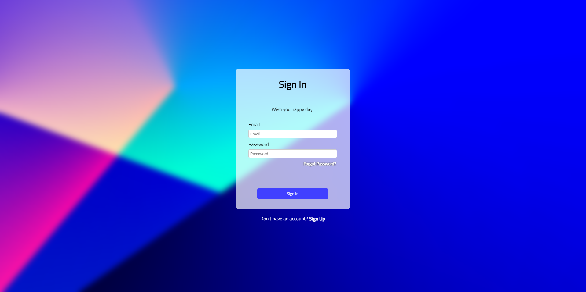
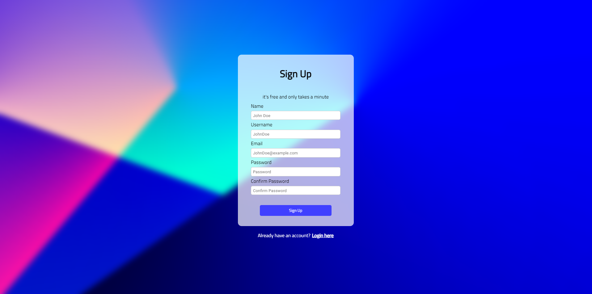
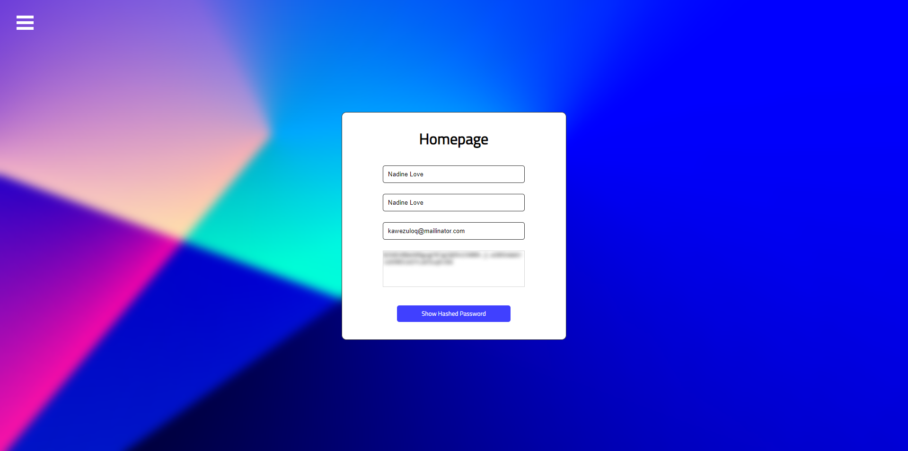

# Authentication with JWT

> built with React, React-Router, Framer-motion, Express, Webpack, MongoDB, Mongoose, Redis.

## Contents

-   [Introduction](#introduction)
-   [Features](#features)
-   [Installation](#installation)
-   [Preview](#preview)
-   [Motivation](#motivation)

## Introduction

JWT(Json Web Token), JWTs represent a set of claims as a JSON object that is encoded in a JWS and/or JWE structure.

although I call it(also most if not everyone) JWT, it is in fact called Secured JWS(Json Web Signature). because there is a third part in JWT called "Signature" which can be used to guarantee the content of the token, the receiver can Base64Url the "header" and Base64Url the "payload" and concatenate the results with "." and then pass it as first parameter to the hashing function "HMACSHA256" if you were using symmetric encryption which is essentially, one shared private key between the sender and the receiver, this private key will be the second parameter for the aforementioned hashing function by that, the hashing function will produce usually a hexadecimal output(64 char if it's SHA256(256 correspond to the number of the bits), because for every 4 bit there is 1 hexadecimal char).

So JWT is merely a set of claims encoded as JSON, it becomes Unsecured JWS, if JOSE(JSON Object Signing and Encryption) Header is set and "alg" property is set to 'none', and it becomes secured JWS if 'alg' is set to one of these algorithms, HS[256 || 384 || 512] or RS[256 || 384 || 512] or ES[256 || 384 || 512].

HS256 => HMAC + SHA256
RS256 => RSASSA-PKCS1-v1_5 + SHA256
ES256 => ECDSA + P-256 + SHA256

## Features

I used a mix of technologies frankly, I wanted to get that sense of managing and thinking about many things in the same time, and I surely did.

used React for front-end. React-Router for client-side routing, also leveraged the new features that came in React-Router 6.4 release, most notable feature is `createBrowserRouter` that enabled features like `loaders`, `actions`, `fetchers`. used Framer-motion for animating the page transitions. used Express in the back-end to build Restful API. used Mongodb through mongoose, also used Redis(I discovered unfortunately that there is no implementation for Redis on windows so I had to use docker to spin up a container from Redis image) for storing JWT tokens upon creating them, so I can later achieve the logout functionality via deleting the stored token upon user logging out.

## Installation

if you wanted to try the app locally you need few things.

steps for installation locally

1. clone the repo
   `git clone https://github.com/tariq-almalki/authn-jwt.git`

2. make sure you have the latest installation of the following:

    - nodejs
    - mongodb
    - docker

**to make sure node installed, type** `node -v` **in the CLI**

**to make sure mongodb installed type** `sc query mongodb` **in the CLI**

_NOTE: this is actually for querying the status of the service if it's up or not(I mean mongodb)_

_NOTE: I'm using here sc which an acronym for service controller which is a tool you can utilize in windows for Creating, Starting, Stopping, Querying or Deleting any Windows SERVICE in Windows😁_

**to make sure docker installed , type** `docker -v` **in the CLI**

3. cd to authn-jwt
4. cd to frontend and backend folders and type `npm i && npm start` in the CLI

you need nodejs for executing javascript, mongodb for storing the user information, and docker you need it because you need to spin up redis container, because the app stores JWT token upon creation in redis, so later when user attempted to log out, JWT token will be deleted, so any authenticated route will return 'Unauthorized Access' if user attempted to access it because there is no JWT token in the sent cookies(yes I stored JWT tokens in the cookies😒).

for spinning up redis container use this command(after making sure docker is up):

`docker run --name redis-container -dp [127.0.0.1:]6379:6379 redis`

_the part between square brackets is optional you run it without it._

## Preview

here is the full user journey starting from sign up page until he reaches homepage.

# Sign In Page

# Sign Up Page

# Homepage

# directory tree of the project

## Motivation

authn-jwt project was built behind the incentive of trying to implement JWT(Json Web Token)
